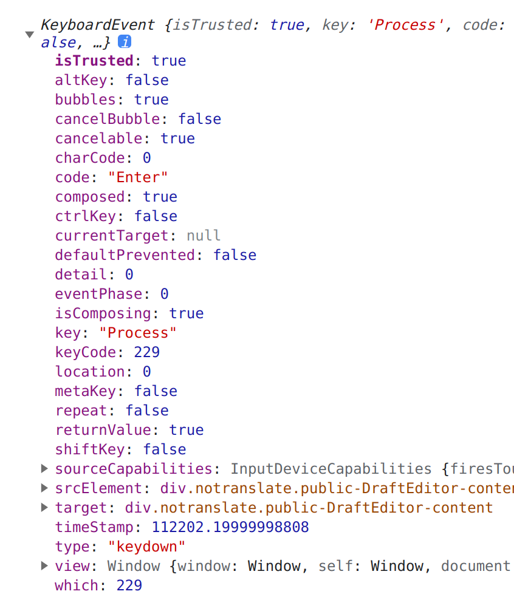

# 输入

## 中文输入法

JS input 输入框监听 `enter` 键的 keydown 事件来发送消息

- windows 中文输入法下不会触发 keydown
- mac 输入中文时，不按空格直接回车也会触发消息发送
- linux - 中文输入法下不会触发 keydown

找到了以下解决方法

### [isComposing](https://developer.mozilla.org/en-US/docs/Web/API/KeyboardEvent/isComposing)

input 事件里有个 isComposing 属性，isComposing 为 true 时代表输入法正在输入，isComposing 为 false 指输入法没有输入，可以通过这个属性来判断是否是中文输入法下按 enter 键。

**注意** safari 浏览器在中文输入法下也为 false

### keyCode

keyCode 虽然已经标记废弃了，但考虑到兼容性，还是可以使用的

> 

中文输入法下按 enter 键，在 keydown 事件里获取到的 keyCode 为 229，而英文状态下为 13。

> 

### key

中文输入法下按 enter 键，在 keydown 事件里获取到的 key 为 `Procress`，而英文状态下为 `Enter`。


## Enter 发送，Ctrl + Enter 换行

需要在 Enter 时阻止浏览器的默认事件(换行) 尽心发送，在 Ctrl + Enter 时添加换行符

```javascript
if (event.ctrlKey && event.key === 'Enter') {
  this.msgText = `${this.msgText}\n`;
} else {
  if (!this.msgText.trimEnd().trimStart()) {
    return;
  }

  this.handleEnterSend(event);
}
```

> 参考：
> https://www.zhangxinxu.com/wordpress/2021/01/js-keycode-deprecated/  
> https://www.zhangxinxu.com/wordpress/2023/02/js-enter-submit-compositionupdate/
